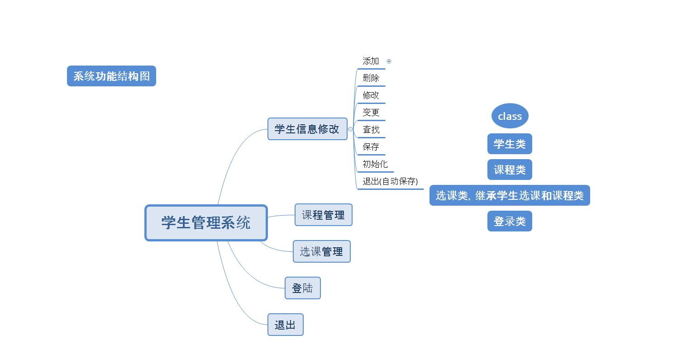
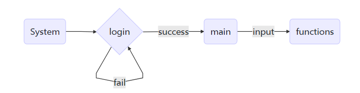

## 第十六周

1. 异常处理
2. 自定义异常处理
3. 分项目合并
4. 宏替换
5. 条件编译
6. 文件流

## c++ program

## 项目 课堂管理程序
1. 功能分析
    - 加分/减分
        - 默认值 / 可选择值 / 后台可设置默认值
    - 随机抽取学生
        - 可选筛选条件 / 可选是否重复
        - 抽取回答问题后 可进行 加分 / 减分 操作
    - 分数统计
        - 自动计算 平均分 / 方差 / 排名
    - 学生查找
        - 可按 学生姓名 / 学号 查找
    - 上下课时间提醒
        - 可自由设定上下课时间 / 可多次设定
    - 自动按学生等级排序
        - 优秀 / 良好 / 及格 / 不及格
    - 批量导入学生信息
        - 批量导入信息 / 分数
    - 自动保存学生信息
    - 登录 / 退出

2. 逻辑分析
    1. 登录 -> 是
        - 选择班级
            - 批量导入
        - 查询加分
            - 加分
            - 减分
            - 分数带默认值，但可以自己选择
        - 分数统计
            - 批量导入学生信息
            - 显示分数
            - 计算平均分
            - 计算方差
            - 自动排名
        - 随机抽问
            - 答对加分或者不处理
            - 答错扣分或者不处理
        - 设置
            - 加分默认值
            - 减分默认值
            - 上下课时间默认值
            - 是否自动计算平均值/方差/排名
            - 抽问的默认加分减分情况
            - 默认班级
            - 设定系统自动退出时间
        - 退出
    2. 登录 -> 否
        - 提示账户或密码错误
        - 重新登录

3. 类分析
    - 学生类 `class Student`
        - 学号
        - 姓名
        - 邮箱
    - 成绩类 继承 学生类 `class Grade`
        - 分数
        - 等级
        - 排名
        - 平均分
        - 方差
    - 系统功能类(带默认值) `class System`
        - ......
		

